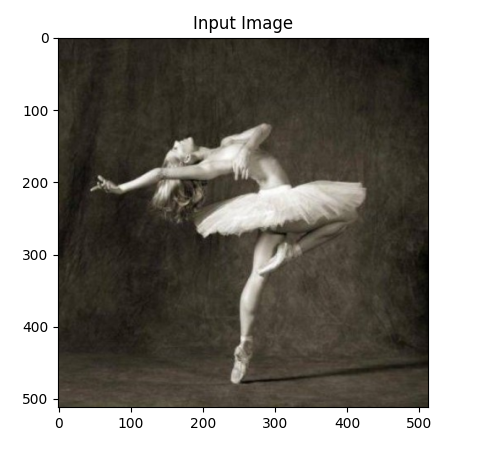
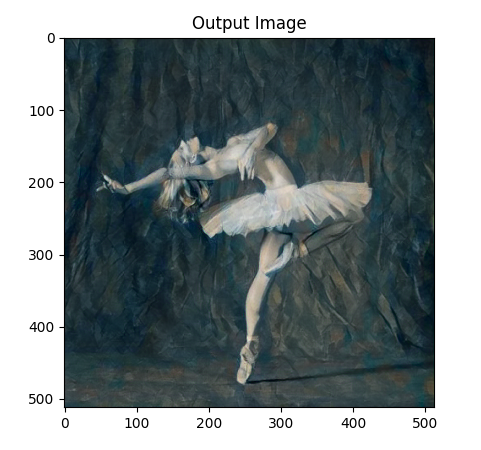
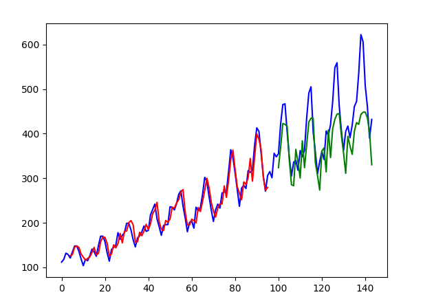

## Some basic ML models

### Under/ image-transfer we can find a basic model that transfers style from one image to another.  

- Results :  

  

### rnn-text/lstm-passangers.py    

- Results :
- Blue is actual data, green is predicted data.
