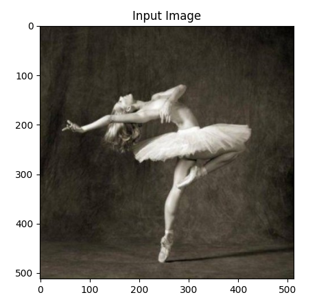
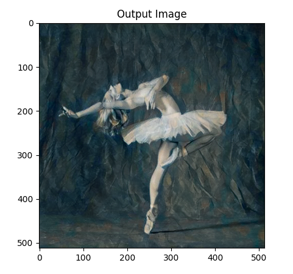
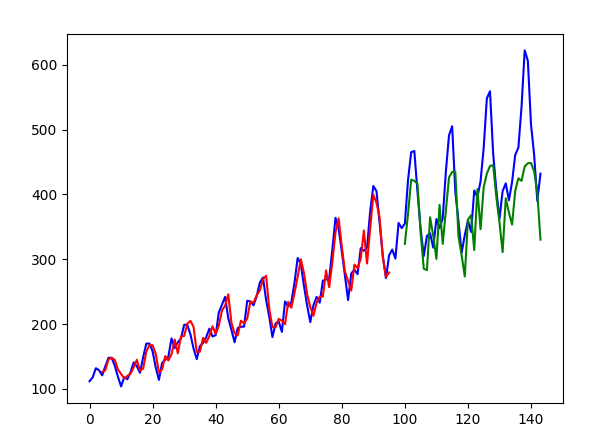
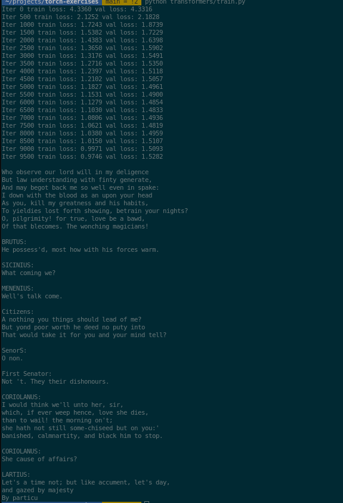

## Some basic ML models

### Under/ image-transfer we can find a basic model that transfers style from one image to another.

- Results :  
  
  

## rnn-text/lstm-passangers.py

- Results :
- Blue is actual data, red is our training set, green is the test set.
  

## lstm-nlp/imdb-reviews.py

- LSTM model that predicts if a review is positive or negative.
- Trained on the infamous IMDB dataset.
- Best Results :
- ```
   Test loss: 0.279
   Test accuracy: 88.455%
  ```

## transformsers/train.py

- Creating similar text to the one that its been trained on(in this case- tiny shakespeare dataset)
- Model overfitting after certain amount of training.(10k iterations ~40 minutes)
- Generated text does look similar to the dataset, but not really english.
- 
